## JAVA 8 to 21


### Record
is a final class that has final fields, it is immutable. introduced in java 14

Auto-generated boilerplate (constructors, getters, equals, hashCode, toString)

we can still override default implementations like to string and add a constructor

getters are named after feild names

cannot extend other classes

can implement interfaces

Cannot use this to assign fields in constructor

```Java
public record Person(String name, int age) {}

Person x = new Person("mohamed", 34);
system.out.println(x.name);
```

#### When to use Record
- when you need an immutable data holder
- you don't need inheritance or mutable state
- you want less boilerplate

Don't use when you need to map to database entity

### Interfaces

- fields defined in interfaces are by nature static, final and public. Basically constant


### Jshell, Java's REPL
A command line tool we can use to experiment with the language dynamically. was introduced in java 9

```Shell
$ jshell
jshell> var myObject = new Object();
myObject ==> java.lang.Object@506e1b77
```

### Static block and Inner class

```Java
public abstract class PlatformSingleton {
  private static final PlatformSingleton INSTANCE;

  static {
    if(System.getProperty("os.name").toLowerCase().contains("mac")){
      INSTANCE = new Mac();
    } else {
      INSTANCE = new Windows();
    }
  }

  public PlatformSingleton getInstance() {
    return INSTANCE;
  }

  public abstract void platformMethod();

  static class Mac extends PlatformSingleton {
    @Override
    public void platformMethod();
  }

  .
  .
  .
}
```
a static block is executed when the class is loaded and can be used for implementing init logic

### inner classes
- inner classes can refernce the parent instance
- fields can be refrenced by name or OuterClass.this
- using static inner classes disabled this

### Synchronized block
The synchronized keyword is used to control access to code blocks or methods to prevent race conditions when multiple threads try to access shared resources concurrently.

1. Synchronized Instance Method
```Java
public synchronized void increment() {
    count++;
}
```

- Locks this object

- Only one thread per instance can execute any synchronized method at a time.

2. Synchronized Block
```Java
public void increment() {
    synchronized(this) {
        count++;
    }
}
```

- Gives you more control over what you lock and when.

- You can synchronize on this, a class-level lock, or any other object

3. Static Synchronized Method

```Java
public static synchronized void log(String msg) {
    // do something
}
```
- Locks the Class object, not an instance.

- Only one thread across all instances can execute this static method at a time.

🔄 What Does synchronized Do Internally?
Each object in Java has an intrinsic lock (monitor).

When a thread enters a synchronized block or method:

It must acquire the object's lock.

If another thread has the lock, it waits (blocked).

When the thread exits the block, it releases the lock.

🧠 Best Practices
Avoid synchronizing long-running code.

Use a separate lock object (final Object lock = new Object();) instead of this for better control.

Prefer concurrent utilities (ReentrantLock, AtomicInteger, ConcurrentHashMap) for advanced use cases.

## 🔐 How `synchronized` Works in Java


### 🧠 What This Diagram Shows

- **Thread 1** acquires the lock and enters the critical section.
- **Thread 2** tries to enter but is **blocked** until Thread 1 releases the lock.
- Once Thread 1 finishes, **Thread 2 gets the lock and proceeds.**

#### Notes from book
- reduce the scope of synchronized as much as possible, for exmple surronding by if condition
- make sure to double check the if condition inside and out to prevent bugs from threads entering togther the synch block (Double checked locking)


### Anonymous inner class and adapter pattern

before java 8

```Java
public class CallableAdapter {
  public ActionListner callableAdapter(Runnable runnable) {
    // anonymous inner class
    return new ActionListner() {
      @Override
      public void actionPerformed(ActionEvent e) {
        runnable.run();
      }
    }
  }
}
```

after Java 8 lambdas

```Java
public class CallableAdapter {
  public ActionListner callableAdapter(Runnable runnable) {
    return e -> runnable.run();
  }
}
```


### Proxy pattern in spring

## 🌐 Spring AOP Proxy Architecture

```mermaid
flowchart LR
    Client[Caller / REST Controller] --> Proxy[🔁 Spring Proxy]
    Proxy -->|Before Advice| Aspect[LoggingAspect.before]
    Proxy --> Target[🎯 PaymentService.processPayment]
    Target -->|After Completion| Aspect2[LoggingAspect.after]

    style Proxy fill:#f9f,stroke:#333,stroke-width:1px
    style Target fill:#bbf,stroke:#333,stroke-width:1px
    style Aspect fill:#bfb,stroke:#333,stroke-width:1px
    style Aspect2 fill:#bfb,stroke:#333,stroke-width:1px
```



## General Notes

- primitive types have a significant performance improvement over primitive wrappers
- auto-unboxing was added to java 8, which wraps primitive types intowrappers for usage with other utilities like adding to a list
- all numeric wrapper objects derive from Number class so you can do MyObject<? extends Number>, you can also do MyObject<? super Number> which means myObject with a type parameter ths is Number or parent of Number
- Comparable is a generic interface that let's us compare two objects <T extends Comparable<T>> so you can use max, min ... etc. Second T in Comparable is because comparable is generic itself and we need to pass a generic to it 
- Set elements are distinct, TreeSet is sorted

Notes on the Final keyword:
- On a class means class cannot be inherited
- On a method prevents from overrides
- on a variable prevents modification


