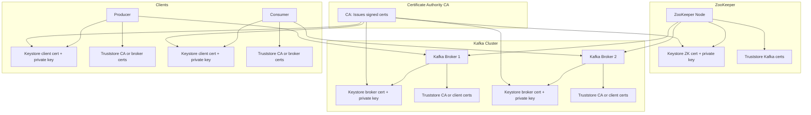
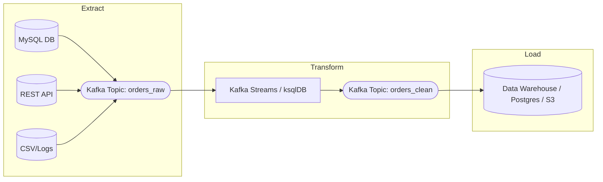

## Why Kafka:

- Event streaming platform, Acts as a buffer
- scalable
- high throughput

### Difference between Kafka and other solutions:
- RabbitMQ: kafka is more performant as kafka uses topics in a unidirectional log without handshake
- Mulesoft: Kafka makes it simple to create a channel of communication simply by producing a message the topic will be autocreated
- Redis: redis does not handle streaming data nor has a history of past messages
- Amazon SQS: it is based on queres also, it is a lot better than RabbitMQ but still Kafka has better speed and throughput. SQS is more expensive
- Amazon SNS: ver very similar; but pricier
- Azure Streaming services: it was not meant for pub sub in general, has similar kafka streams
- Google Pub/sub: same as amazon SNS, versimilar but pricier (does not offer topic compaction)
  - How it handles retention:
    - Persistent Storage: Messages can be retained for up to 7 days (or 365 for Lite topics)
    - No Log Compaction: Unlike Kafke, Pub/Sub does not remove older messages based on key updates
    - Snapshot & Seek: subscribers can seek to a past timestamp or snapshot but cannot perform log compaction

### Kafka packaging versions:
- Confluent Cloud
- Cloudera
- Strimzi offers the Helm charts to deploy kafka to k8s

### DB Connectors:
- JDBC connectory to cover RDBMS
- Debezium also offers connector that include no-Sql DBs
- Presto connector that allos us to query Kafka using Presto queries

### Kafka CLI & commands:

- Download the Kafka CLI [Binary](https://kafka.apache.org/downloads)
- add the kafka cli to the path export PATH="/Users/mohamedkarara/Downloads/kafka_2.13-4.0.0/bin:$PATH" in zshrc
- to send a message:
  - kafka-console-producer.sh --bootstrap-server 127.0.0.1:9092 --topic first_topic
- to consume messaga:
  - kafka-console-consumer.sh --bootstrap-server 127.0.0.1:9092 --topic first_topic --from-beginning

- to create a topic:
  - kafka-topics.sh --create --bootstrap-server 127.0.0.1:9092 --replication-factor 1 --partitions 3 --topic myorders

- to reasign replication:
  - kafka-reassign-partitions.sh --bootstrap-server 127.0.0.1:9092 --reassignment-json-file increase_replication.json --execute
- curl localhost:8082/topics

- to set producer properties for key kafka-console-producer.sh --bootstrap-server 127.0.0.1:9092 --topic myorders --property "parse.key=true" --property "key.separator=:"

- to get all consumer groups
kafka-consumer-groups.sh --all-groups --all-topics --bootstrap-server 127.0.0.1:9092 --describe

- to start a standalone kafka connect
connect-standalone.sh worker.properties filesink.properties   


## Kafka Architecture:

### Kafka Zookeeper:
- Service discovery
- Service Address Retrieval
- Management Elections

### REST Proxy:
- communicates with broker and zookeeper
- to get a list of broker ids active in the cluster curl localhost:8082/brokers

### Kafka Brooker:
- depends on zookeper
- Kafka broker id should be unique in the cluster
- holds the topics and messages
- needs 2 ports 1 internal communcation and one external usually 9092

### Kafka Message:

Headers -> key & value

key -> any type

value -> Anything

timestamp -> Epoch


### Kafka Topics:
- Retention:
  - Days: keep messages of up to N days then delete
  - Bytes: keep messages until topic has more than X bytes
  - None: store all messages from begining of time
- partitions:
  - topics is split into N partitions
  - using a hash based on the key
  - not all topics are partitioned equally
  - to achieve high availability we replicate each partition on a different broker

### Kafka Producers:

:::mermaid
graph TD;
    A[Topic, partition, key, value] --> |Kafka record| B[Serializer];
    B --> C[Partitioner]
    C --> D[Topic A Part 0]
    C --> E[Topic B Part 1]
    D --> F{Fail?}
    E --> F
    F --> |yes| G{Retry?}
    G --> |yes| B
    G --> |can't rerty or got limit, throw exception|A
    F --> |successful return metadata| A
:::

this happens when you do .producer.send();
- Partitioner redirects messages to the correct partition
- when we init the producer, there is an initial handshake to the brooker, then kafka goes to zookeper and fetches other details, now the producer knows where each partition lives. The Partitions information is caught on the initial instantiation of the producer Object

- adding multiple consumers to the same group id means that each consumer will be getting messages from different partitions based on key

```Java
Properties properties = new Properties();

properties.put(ProducerConfig.BOOTSTRAP_SERVERS_CONFIG, "localhost:9092");
properties.put(ProducerConfig.KEY_SERIALIZER_CLASS_CONFIG, StringSerializer.class);
properties.put(ProducerConfig.VALUE_SERIALIZER_CLASS_CONFIG, IntegerSerializer.class);
```

```Java
ProducerRecord producerRecord = new ProducerRecord<>("topicName", key, value);

Future send = producer.send(producerRecord);
```

Future contains metadata of the delivery like:

```Java
metadata.offset();
metadata.partition();
metadata.timestamp();
metadata.topic();
```

in the end

```Java
producer.flush();
producer.close();
```

### Kafka Consumers

- consumers typically exist as a group
- a single consumer will end up being inefficint with large amounts of data and may never catch up to a lag
- consumer group id is key so kafka knows that messages should be distributed to all consumers without duplication
- partitions cant be shared with consumers in same group
- every consumer should be on it's own instance

Deserializers and consumer Config

```java
Properties properties = new Properties();

properties.put(ConsumerConfig.BOOTSTRAP_SERVERS_CONFIG, "localhost:9092");
properties.put(ConsumerConfig.GROUP_ID_CONFIG, "my_group");
properties.put(ConsumerConfig.KEY_DESERIALIZER_CLASS_CONFIG, StringSerializer.class);
properties.put(ConsumerConfig.VALUE_DESERIALIZER_CLASS_CONFIG, IntegerSerializer.class);
properties.put(ConsumerConfig.AUTO_OFFSET_RESET_CONFIG, "earliest"); // what happens if kafka hasnt seen you before

KafkaConsumer<String,String> consumer = new KafkaConsumer<>(properties);
```

Rebalances:
- regardless of what a consumer is doing, the send a heartbeat to kafka at regular intervals, this is configurable
- specifically to the coordinator inside the broker, basically letting them know they are alive
- when we poll for recodrs that lets kafka know thst consumer is alive
- close method of consumer lets kafka know they are not alive anymore which triggers a rebalance


### Kafka connect:
- acts with sources and sinks, basically either takes data from a database and stores it in a broker or from a broker to a DB
- *source connectors*: Transfer data from a source to kafka
- *Sink connector*: Transfer data from kafka to sink

:::mermaid
graph TD;
    A[Data Source DB, API, Files] -->|Source Connector| B[Kafka Topic];
    B -->|Consumer Apps| C[Microservices, Analytics, Storage];
    D[Kafka Topic] -->|Sink Connector| E[Data Sink DB, Elastic, HDFS];

    subgraph Kafka Connect
        B & D
    end

    style A fill:#f9f,stroke:#333,stroke-width:2px;
    style E fill:#bbf,stroke:#333,stroke-width:2px;
:::

### **Explanation of the Diagram**
1. **Source Connector** pulls data from an external system (e.g., Database, API, File System) into Kafka.
2. **Kafka Topic** stores the incoming data.
3. **Consumers (Apps, Microservices, Analytics)** read from the Kafka topic.
4. **Sink Connector** moves data from Kafka to another system (e.g., Database, Elasticsearch, HDFS, Cloud Storage).

### To download connectors:
- brew tap confluentinc/homebrew-confluent-hub-client
- brew install --cask confluent-hub-client
- it downloads the sink connector and the avro converter for example


### Schema Registry (Avro):
- Serialization is defined by schema
- Schemas are JSON based
- Codegen available at command line
- Codegen available by Maven, Gradle .. etc

#### Has 3 modes:
- Generic: only used to validate schema but no codegen
- Specific mode: uses an avsc file and the codegen capabilities to generate the code we need
- Reflection mode: class based generation of avro file

#### Avro Schema Data Types

| Data Type   | Description |
|------------|------------|
| **null**    | Represents a null value (no data). |
| **boolean** | Represents `true` or `false` values. |
| **int**     | 32-bit signed integer. |
| **long**    | 64-bit signed integer. |
| **float**   | 32-bit IEEE 754 floating-point number. |
| **double**  | 64-bit IEEE 754 floating-point number. |
| **bytes**   | Sequence of arbitrary bytes. |
| **string**  | Unicode string. |
| **record**  | A complex type that defines a set of named fields. |
| **enum**    | Represents a fixed set of symbols (string values). |
| **array**   | Ordered list of values of the same type. |
| **map**     | Key-value pairs, where keys are strings and values are of a specified type. |
| **union**   | Represents multiple possible types (e.g., `["null", "string"]`). |
| **fixed**   | Fixed-length sequence of bytes (e.g., `fixed(16)`). |

#### Avro Schema Example

Below is an example of an Avro schema defining a **User** record with multiple data types.

```json
{
  "type": "record",
  "name": "User",
  "namespace": "com.example",
  "fields": [
    { "name": "id", "type": "int" },
    { "name": "name", "type": "string" },
    { "name": "email", "type": ["null", "string"], "default": null },
    { "name": "age", "type": ["null", "int"], "default": null },
    { "name": "is_active", "type": "boolean" },
    { "name": "friends", "type": { "type": "array", "items": "string" } },
    { "name": "metadata", "type": { "type": "map", "values": "string" } },
    { "name": "created_at", "type": { "type": "long", "logicalType": "timestamp-millis" } }
  ]
}
```

:::mermaid
flowchart TD
    subgraph Producer Side
        P1[Producer] --> SR1[Schema Registry]
        P1 -->|Avro + Schema ID| KT1[Kafka Topic]
    end

    subgraph Kafka Cluster
        KT1
    end

    subgraph Consumer Side
        KT1 --> C1[Consumer]
        C1 --> SR1
    end

:::

- **Producer** registers its Avro schema with **Schema Registry**
- It then **sends data + schema ID** to a Kafka Topic
- **Consumer** receives the message and uses the **schema ID** to fetch schema from Schema Registry and deserialize it


### kafka Streams:

:::mermaid
flowchart LR
    subgraph Input
        A1[(Input Topic 1)]
        A2[(Input Topic 2)]
    end

    subgraph Kafka Streams App
        A1 --> P1[Stream Processor 1]
        A2 --> P2[Stream Processor 2]
        P1 --> M[State Store]
        P2 --> M
        M -->|Joins, Aggregations| P3[Processor 3]
    end

    P3 --> O1[(Output Topic)]
:::

- **Input Topics**: Kafka topics that the stream app consumes from.
- **Stream Processors**: Stateless or stateful processing logic.
- **State Store**: Used for things like joins, windowed operations, or aggregations.
- **Output Topic**: Final results are written back to Kafka.

#### Properties for Kafka streams app:
```Java
Properties props = new Properties();
props.put(StreamsConfig.APPLICATION_ID_CONFIG, "my_stream_app");
props.put(StreamsConfig.BOOTSTRAP_SERVERS_CONFIG, localhost:9092);
props.put(StreamsConfig.DEFAULT_KEY_SERDE_CLASS_CONFIG, Serdes.STring().getClass());
props.put(StreamsConfig.DEFAULT_VALUE_SERDE_CLASS_CONFIG, Serdes.Integer().getClass());
props.put("schema.registry.url", "http://localhost:8081");
```

- create an application.id that represents your application group or "team"
- Serde is combination of Serializer/Deserializer
- every stream application and ksql app is a consumer-producer

#### Streams app:

```Java
StreamsBuilder builder = new StreamsBuilder();

KStream<String, DisasterValue> rawReadings = builder.stream("DisasterReadings", Consumed.with(Serdes.String(), Serdes.Integer()));

stream.filter(...).through("new_topic").flatMap(...).to("other_topic")

```

- Start with a StreamerBuilder object
- represents our data pipeline
- perform functional operations on stream (map, join ...)
- Dump results to a topic using through to post to topic and continue

## KSQL
is the CLI to query KSQLDB which is a thin layer over kafka streams and permits to do simple stuff without creating a streams app with code

### CLI
- docker exec -it ksqldb-cli ksql http://ksqldb-server:8088
- SET 'auto.offset.reset'='earliest';
- CREATE STREAM tempReadings (zipcode VARCHAR, sensortime BIGINT, temp DOUBLE)
  WITH (kafka_topic='readings', timestamp='sensortime', value_format='json', partitions=1); -> creates a stream tempReadings with an associated topic of readings, adds timestamp renamed to sensortime
- INSERT INTO tempReadings (zipcode, sensortime, temp) VALUES ('1865', UNIX_TIMESTAMP(), 20);
- SELECT zipcode, TIMESTAMPTOSTRING(WINDOWSTART, 'HH:mm:ss') as windowtime, COUNT(*) AS rowcount, AVG(temp) as temp
  FROM tempReadings
  WINDOW TUMBLING (SIZE 1 HOURS)
  GROUP BY zipcode EMIT CHANGES;

- CREATE TABLE highsandlows with (kafka_topic='readings') AS
  SELECT MIN(temp) as min_temp, MAX(temp) as max_temp, zipcode
  FROM tempReadings GROUP BY zipcode;  -> tables are compacted contained the latest update

## Kafka Administration:

## 🔐 Keystore vs Truststore (SSL/TLS)

## 🔐 Kafka SSL Setup with Keystore & Truststore



- **Keystore**: Each component (broker, ZooKeeper, client) has a keystore containing its **own certificate** + **private key**.
- **Truststore**: Contains **trusted certs** from other components or the CA (to verify the other party).
- **CA**: Signs all certificates to create trust across all participants.
- **Mutual TLS**: If enabled, both sides (e.g., broker and client) verify each other using their truststores.

---

### 🛠️ How It Maps to Kafka Config Files

#### 🔑 For configuiring (`server.properties`, `producer.properties`, `consumer.properties`)
```properties
ssl.keystore.location=/path/to/broker.keystore.jks
ssl.keystore.password=secret
ssl.truststore.location=/path/to/broker.truststore.jks
ssl.truststore.password=secret
```

### Encrypting zookeeper

Offline properties
```properties
sslQorum= true
portUnification=false
serverCnxnFactory=org.apache.zookeeper.server.NettyServerCnxnFactory
secureClientPort=2281
ssl.hostnameVerification=false
ssl.quorum.hostnameVerification=false

ssl.quorum.keyStore.location=/security/zookeeper-2.keystore.jks
ssl.quorum.keyStore.password=password
ssl.quorum.trustStore.location=/security/zookeeper-2.truststore.jks
ssl.quorum.trustStore.password=password

secureClientPort=2281
ssl.keyStore.location=/security/zookeeper-2.keystore.jks
ssl.keyStore.password=password
ssl.trustStore.location=/security/zookeeper-2.truststore.jks
ssl.trustStore.password=password"
```


## Desinging using Event driven Architecture in mind:

### At least once processing:
Every message will be processed one or more times.
You won’t lose any messages, but duplicates are possible.

#### Example:
Imagine a Kafka consumer processes an order:

- Kafka sends message "Order ID 123" to your app.

- Your app processes the order.

- Before it commits the offset (acknowledging the message), the app crashes.

- When restarted, Kafka sends the same message again.

- Result: Order ID 123 might be processed twice unless you handle idempotency.

#### Why this happens:
Because the consumer acks (commits the offset) after processing the message. If it crashes before committing, Kafka re-sends the same message.

#### How to handle duplicates:
 - Use idempotent processing (processing the same message multiple times has no additional effect).
 - Store a deduplication key (e.g., order ID) in your DB.
 - Use Exactly-once Semantics (EOS) if duplicates are unacceptable (more complex).


### Reasons for event driven:
- Every event happening in your application can be traced back to a kafka topic and is stored
- If each microservice is a kafka streams app, then everything goes through kafka. And kafka has an abstraction called the log that makes it possible to replay messages (offsets, at least once processing)
- this means Kafka becomes the WAL(write ahead log) of the app and allows for things like multi-phase transactions

#### What is ETL:
stands for Extract -> Transform -> load

It's a common process used in data engineering to move data from one system (like databases, files, APIs) into a data warehouse or analytics system.

Kafka can power real-time ETL:

- Use Kafka Connect to Extract

- Use Kafka Streams or ksqlDB to Transform

- Sink to a DB or warehouse to Load


