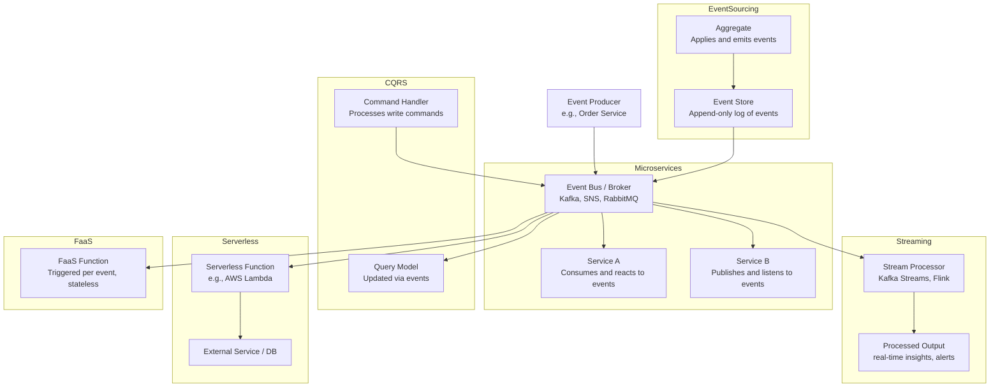

## Using kafka to design Event-driven Applications

### Event-Driven Architecture (EDA)
A software architecture pattern promoting the production, detection, consumption of, and reaction to events.

## ⚙️ Examples of Event-Driven Architectures

### 🧠 Quick Explanation of Each Architecture Pattern

| Pattern         | Description |
|----------------|-------------|
| **Microservices** | Services communicate via events rather than direct calls. |
| **CQRS**         | Separate **write (Command)** and **read (Query)** models; read model updated via events. |
| **Streaming**     | Continuous processing of real-time data streams (Kafka Streams, Apache Flink). |
| **Serverless**    | Cloud functions triggered by events without managing servers (e.g., AWS Lambda). |
| **FaaS**          | Like serverless, but focused on lightweight, event-driven **functions**. |
| **Event Sourcing**| State is rebuilt by **replaying past events**, not by storing current state directly. |

### Messages, Events, Commands

Messages: basic unit of communication (string, number, blob)

Event: informs listeners of something that happned, (should be refered to in past tense)

command: a targeted action

### Benifits of EDA
- Decoupling
- Encapsulation
- optimization (speed)
- scalability

### Drawbacks
- steep learning curve
- complexity
- loss of transactionality
- lineage (finding out the source of event)

### Event Storming & DDD

⚡ What is Event Storming?
Event Storming is a collaborative workshop technique used to quickly explore and model business processes through domain events.

🔍 Key Concepts:
Involves developers, domain experts, and stakeholders.

Focuses on identifying key domain events (e.g., OrderPlaced, PaymentProcessed).

Uses sticky notes on a wall or whiteboard (or digital equivalents like Miro/Mural).

Helps discover:

Commands (e.g., PlaceOrder)

Aggregates (e.g., Order)

Policies (e.g., send confirmation email after order)

External systems and boundaries (e.g., APIs, UIs)

✅ Benefits:
Breaks silos between tech and business

Encourages shared understanding

A perfect starting point for designing microservices

🧠 What is Domain-Driven Design (DDD)?
Domain-Driven Design is a software design philosophy that focuses on deeply understanding the business domain and structuring your code around it.

## 🧠 Domain-Driven Design (DDD) – Core Concepts

| Concept             | Description |
|---------------------|-------------|
| **Domain**          | The area of knowledge or business your software is built to model (e.g., e-commerce, banking). |
| **Entity**          | An object that has a unique identity and lifecycle (e.g., `Customer`, `Order`). |
| **Value Object**    | An immutable object that describes some characteristic but has no identity (e.g., `Address`, `Money`). |
| **Aggregate**       | A cluster of domain objects that are treated as a single unit. One entity is the "root" and controls consistency. |
| **Bounded Context** | A boundary within which a specific domain model is defined and applicable. Helps avoid ambiguity. |
| **Ubiquitous Language** | A shared language used by developers and domain experts, based on the business vocabulary. |
| **Repository**      | A pattern that provides access to aggregate roots, simulating a collection in memory. |
| **Service**         | A stateless object that performs a business operation not naturally part of an entity or value object. |

✅ Why DDD?
Keeps business logic at the center of your design

Promotes modularity (via bounded contexts)

Pairs naturally with microservices and event-driven architecture

🔁 How Event Storming + DDD Work Together
Event Storming helps you discover domain events and map the process.

You then apply DDD to design aggregates, define contexts, and model behaviors based on what you discovered.